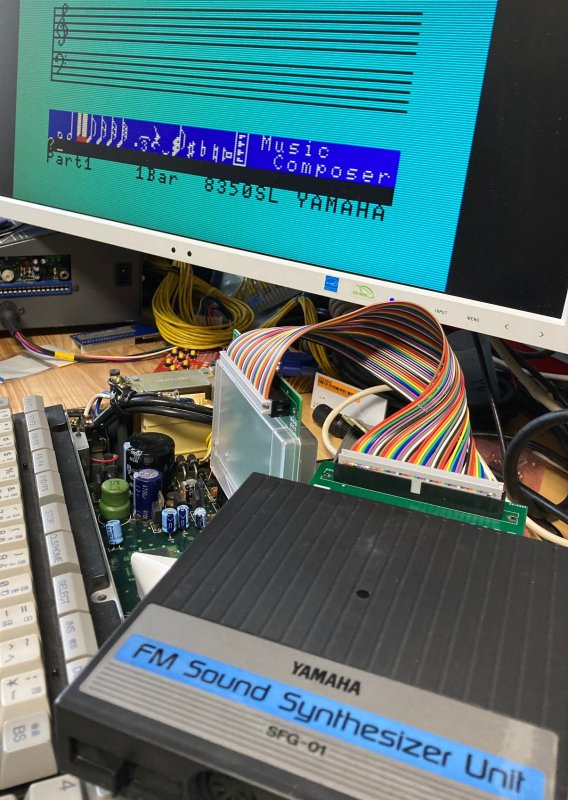
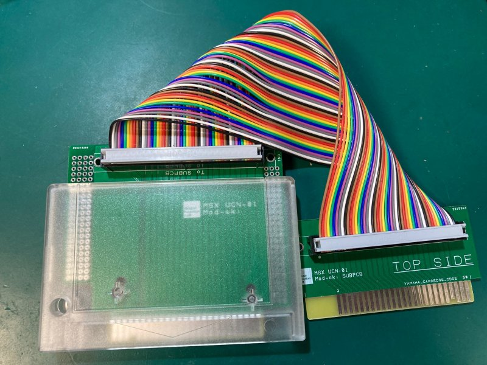
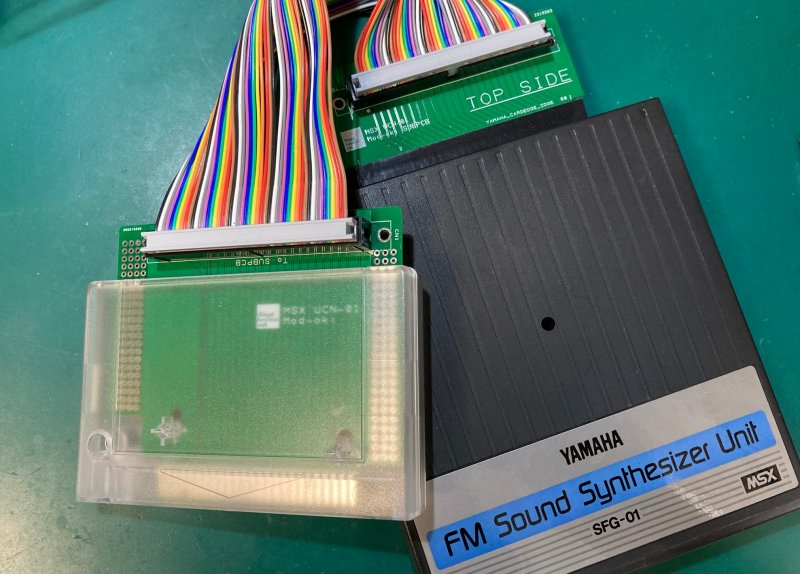
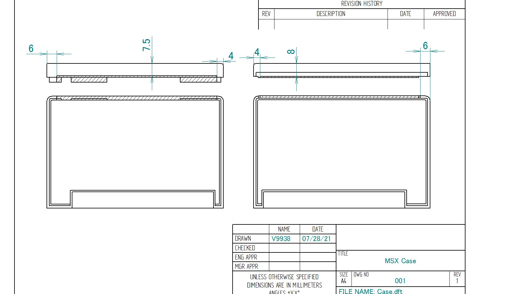

# MSX用カートリッジ UCN-01もどきアダプター
YAMAHA UCN-01ユニットコネクタの互換ユニットです。  
60pinのSFGヤマハモジュールをMSXカートリッジスロットに挿入するためのアダプタです。  

  
  
  
なお、本基板および加工済カートリッジケースは、Boothにて頒布しています。  

●基板/完成品  
https://ifc.booth.pm/items/3365714  
  
●加工済カートリッジシェル  
https://ifc.booth.pm/items/3365816  

## ■ 使用方法
60pinのSFGコネクタをユニットに接続してください。接続時はTOP SIDEの面が表になるように接続します。  
ケーブルをセットしたら通常のカートリッジ同様に電源を切ったMSXスロットに反対側を接続して使用してください。  
  

## ■ 付属フラットケーブルと接続方向について
初期ロットの付属フラットケーブルについては、コネクタの入手が都合によりツメが無いコネクタを採用しています。  
逆接続が可能なため基板上の50pinコネクタの白ポチ同士が同じ色のケーブルが来るようにストレートに必ず接続してください。  
なおケーブルにはUL規格に準拠した取り回しが楽なスダレタイプのケーブルを採用しています。  
  
  
  

特殊なケーブルでは無いので、任意の50ピンのIDF規格のケーブルが使用できます。  
ただ、MSXバスをそのまま延長しているため、あまり長くしすぎるとノイズなどで誤動作の原因になる可能性があります。
 
## ■ 頒布基板について
本製品は安価に頒布するため端子部はハンダメッキになっています。  
通常使用では問題は確認されていませんが、金メッキに比べると中長期的な信頼製や耐久性が劣ります。
あらかじめご了承ください。

ガーバデータについては、付属データを参照ください。  

## ■ カードリッジシェルについて
RGRさんのTransparent Cartridge Shell for MSX Konami-styleを切削加工したものを使用しています。  
https://retrogamerestore.com/store/msx_cart_shell/  
  
  
  

当方でも加工済みシェルを用意しており、シェルはBoothや委託先でも購入が可能です。  
輸入と加工の都合で若干の小傷がある場合があります。あらかじめご了承ください。  

切削加工部分については、下記図面を参照ください。（ハッチ部分が切削箇所）

  

